TradeBot — Console Portfolio Simulator

A modern, cross-platform console application built with **C# .NET 8.0** 
that simulates a real-world trading environment. TradeBot demonstrates 
advanced Object-Oriented Programming concepts, MongoDB database integration, 
and clean architecture principles.

---

## Features

- **User Authentication** — Secure signup/login with BCrypt password hashing
- **Portfolio Management** — Track crypto and stock assets in real-time
- **Live Market Simulation** — Prices update automatically every 5 seconds
- **Buy / Sell Trading** — Full trading engine with fee calculations
- **Portfolio Analytics** — Profit/Loss tracking per asset
- **Price Chart** — Text-based price history visualization
- **Transaction History** — Text-based transaction history
- **Deposit Funds** — Virtual money for taking trade
- **Stop Loss / Take Profit** — Automated risk management alerts
- **Trading Goals** — Set financial targets with progress tracking
- **Reports** — Export trade history to CSV and JSON files
- **Cross Platform** — Runs on Windows, macOS, and Linux

---

## 🛠️ Tech Stack

| Technology | Purpose |
|-----------|---------|
| C# .NET 8.0 | Core language and runtime |
| MongoDB | Database for users, portfolios, transactions |
| MongoDB.Driver | Official MongoDB C# driver |
| BCrypt.Net-Next | Secure password hashing |
| Spectre.Console | Beautiful console UI and charts |
| System.IO | CSV and JSON file generation |
| System.Threading | Background market simulation |

---

## 🏗️ Architecture & OOP Concepts

### Abstraction
```csharp
// Abstract base class — cannot be instantiated directly
public abstract class Asset : ITradable, IReportable
{
    public abstract decimal CalculateValue();
    public abstract string GetMarketUpdate();
    public abstract string AssetType { get; }
}
```

### Inheritance
```csharp
// CryptoAsset inherits from Asset
public class CryptoAsset : Asset
{
    public decimal GasFee { get; set; }
    public string Blockchain { get; set; }
}

// StockAsset inherits from Asset
public class StockAsset : Asset
{
    public decimal DividendYield { get; set; }
    public string Exchange { get; set; }
}
```

### Encapsulation
```csharp
// Wallet protects balance — cannot be changed directly
public class Wallet
{
    private decimal _balance;
    public decimal Balance { get => _balance; }

    public void Deposit(decimal amount) { ... }
    public void Withdraw(decimal amount) { ... }
}
```

### Polymorphism
```csharp
// Single loop handles all asset types
foreach (Asset asset in portfolio.GetAllAssets())
{
    assetValue += asset.CalculateValue(); // Each type handles differently
    Console.WriteLine(asset.GetMarketUpdate());
}
```

### Interfaces
```csharp
public interface ITradable
{
    bool CanBuy(decimal amount, decimal walletBalance);
    bool CanSell(decimal amount);
    void Buy(decimal amount);
    void Sell(decimal amount);
}

public interface IReportable
{
    string GenerateReport();
}
```

---

##  Project Structure
TradeBot/
│
├── Models/                  # Domain models / blueprints
│   ├── Asset.cs             # Abstract base class (Abstraction)
│   ├── CryptoAsset.cs       # Crypto assets — BTC, ETH (Inheritance)
│   ├── StockAsset.cs        # Stock assets — AAPL, MSFT (Inheritance)
│   ├── Wallet.cs            # Balance management (Encapsulation)
│   └── Domain.cs            # User, Portfolio, Transaction, Goals
│
├── Interfaces/              # Contracts / rules
│   └── IInterfaces.cs       # ITradable, IReportable, IRepository
│
├── Data/                    # Database layer
│   └── MongoDbContext.cs    # MongoDB connection and collections
│
├── Repositories/            # Data access layer (Repository Pattern)
│   └── Repositories.cs      # UserRepo, PortfolioRepo, TransactionRepo
│
├── Services/                # Business logic
│   ├── AuthService.cs       # Login / Signup
│   ├── TradingEngine.cs     # Buy / Sell execution
│   ├── MarketSimulator.cs   # Background price simulation
│   ├── ReportingService.cs  # CSV / JSON export
│   ├── AnalyticsService.cs  # Profit / Loss calculations
│   ├── AlertService.cs      # Stop Loss / Take Profit
│   ├── PriceHistoryService.cs # Price history tracking
│   └── GoalService.cs       # Trading goals management
│
├── Utils/                   # Helper utilities
│   └── ConsoleUI.cs         # All display and input methods
│
├── Program.cs               # Application entry point
├── Dockerfile               # Docker configuration
├── docker-compose.yml       # Docker orchestration
└── README.md                # Project documentation

---

## 🗄️ Database Design

MongoDB is used with the following collections:
TradeBotDB
├── Users
│   ├── _id (ObjectId)
│   ├── Username (unique)
│   ├── PasswordHash (BCrypt)
│   ├── Email
│   └── CreatedAt
│
├── Portfolios
│   ├── _id (ObjectId)
│   ├── UserId
│   ├── Wallet { Balance, Currency }
│   ├── CryptoAssets []
│   ├── StockAssets []
│   └── Transactions []
│
├── Transactions
│   ├── _id (ObjectId)
│   ├── PortfolioId
│   ├── Type (Buy/Sell)
│   ├── AssetSymbol
│   ├── Quantity
│   ├── PricePerUnit
│   └── Timestamp
│
└── TradingGoals
├── _id (ObjectId)
├── PortfolioId
├── GoalName
├── TargetAmount
├── StartingAmount
├── TargetDate
└── IsCompleted

---

##  Prerequisites

Before running the project, make sure you have:

- [.NET 8.0 SDK](https://dotnet.microsoft.com/download/dotnet/8.0)
- [MongoDB Community Server](https://www.mongodb.com/try/download/community)
- [Visual Studio 2022](https://visualstudio.microsoft.com/) or later

---

## 🔧 Installation & Setup

### Step 1 — Clone the repository
```bash
git clone https://github.com/yourusername/TradeBot.git
cd TradeBot
```

### Step 2 — Install dependencies
```bash
dotnet restore
```

### Step 3 — Start MongoDB
```bash
# Windows
net start MongoDB

# macOS
brew services start mongodb-community

# Linux
sudo systemctl start mongod
```

### Step 4 — Run the application
```bash
dotnet run
```

---

##  Docker Setup

### Run with Docker Compose
```bash
# Build and start
docker-compose build
docker-compose up

# Interact with the app
docker attach tradebot_app

# Stop
docker-compose down
```

### Docker Architecture
Docker
├── tradebot_app    # C# Console Application
└── tradebot_db     # MongoDB Database

---

##  How to Use

### 1. Create Account
App starts → [S] Sign Up
→ Enter username, email, password
→ $10,000 added to wallet automatically

### 2. Buy Assets
Main Menu → [B] Buy
→ Enter symbol: BTC
→ Enter quantity: 0.5
→ Trade executed!

### 3. Set Stop Loss
Main Menu → [SL]
→ Symbol: BTC
→ Type: [1] Stop Loss
→ Target price: $60,000
→ Quantity: 0.5
→ Alert set! Auto-sells when price drops

### 4. Set Trading Goal
Main Menu → [TG]
→ Goal name: "First Million"
→ Target: $1,000,000
→ Date: 31/12/2025
→ Track progress with [VG]

### 5. Generate Reports
Main Menu → [R]
→ [1] Transaction CSV
→ [2] Portfolio CSV
→ [3] Full JSON Report
→ Saved to /reports folder

---

## 📋 Main Menu Options

| Option | Feature |
|--------|---------|
| `P` | View Portfolio |
| `M` | Live Market Snapshot |
| `B` | Buy Asset |
| `S` | Sell Asset |
| `A` | Add New Asset |
| `AN` | Portfolio Analytics |
| `SL` | Stop Loss / Take Profit |
| `VA` | View Active Alerts |
| `CH` | Price Chart |
| `TG` | Set Trading Goal |
| `VG` | View Goal Progress |
| `GH` | Goal History |
| `H` | Transaction History |
| `R` | Generate Report |
| `D` | Deposit Funds |
| `X` | Logout |

---

## 🔒 Security

- Passwords are **never stored in plain text**
- BCrypt hashing with work factor 11
- Each user has isolated portfolio data
- MongoDB connection is local by default

---

## 📦 NuGet Packages

```xml
<PackageReference Include="MongoDB.Driver" Version="2.x.x" />
<PackageReference Include="BCrypt.Net-Next" Version="4.0.3" />
<PackageReference Include="Spectre.Console" Version="0.x.x" />
```

---

## 🤝 Contributing

1. Fork the repository
2. Create your feature branch
```bash
   git checkout -b feature/AmazingFeature
```
3. Commit your changes
```bash
   git commit -m "Add AmazingFeature"
```
4. Push to the branch
```bash
   git push origin feature/AmazingFeature
```
5. Open a Pull Request

---

## 📄 License

This project is licensed under the MIT License.

---

## 👩‍💻 Author

**Your Name**
- GitHub: [@yourusername](https://github.com/yourusername)
- Email: your.email@example.com

---

## 📸 Screenshots

### Main Menu
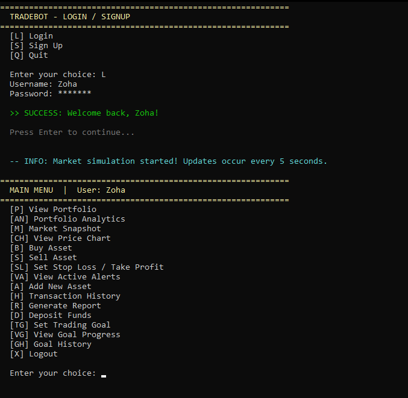

### Portfolio View
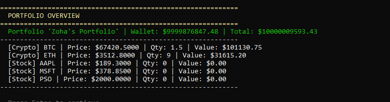

### Live Market
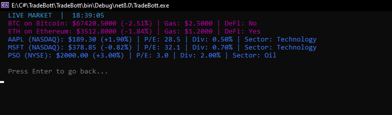

### Price Chart
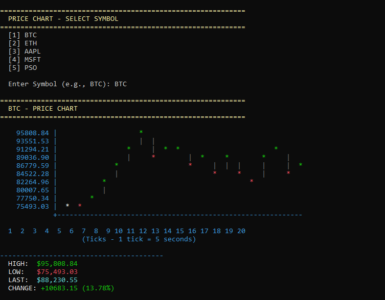

### Portfolio Analytics
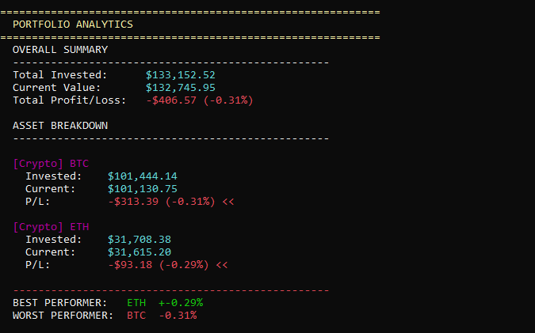

### Trading Goal Progress
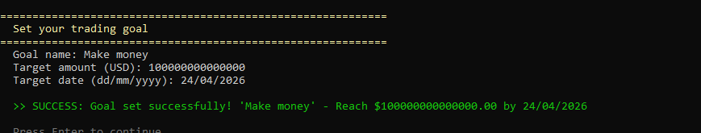

### Transaction History
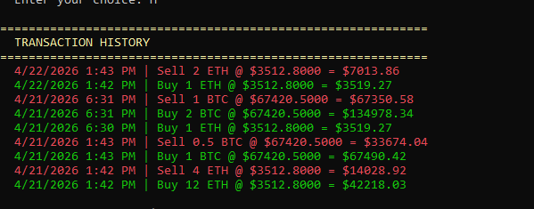
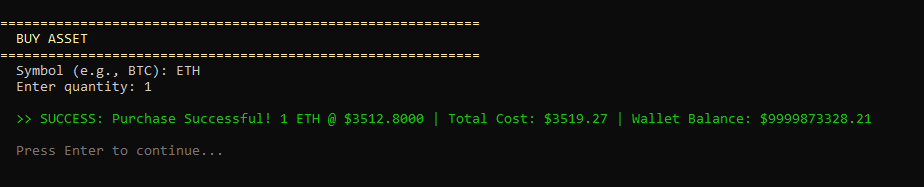
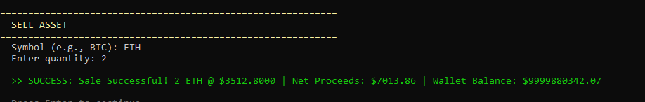
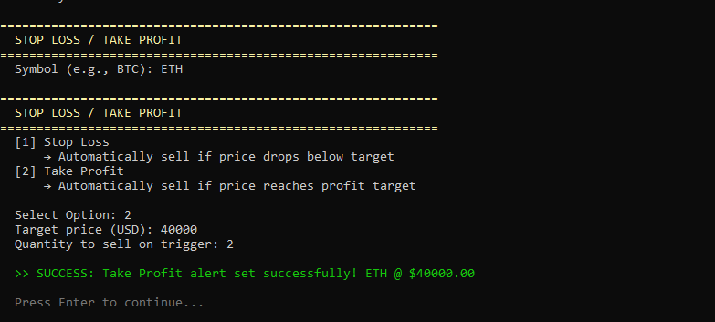


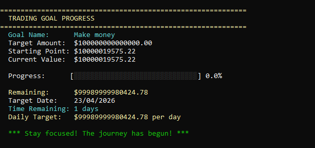
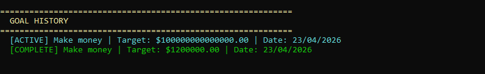
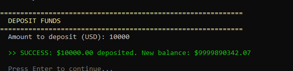
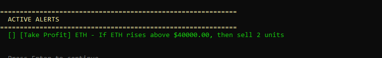

### Generated Report
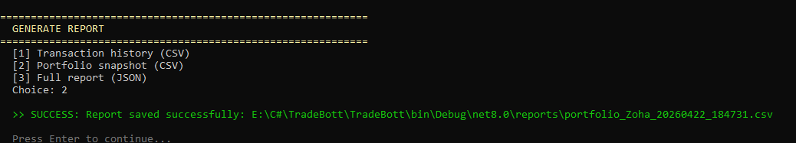

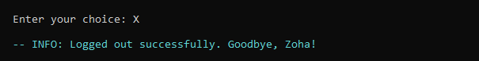
